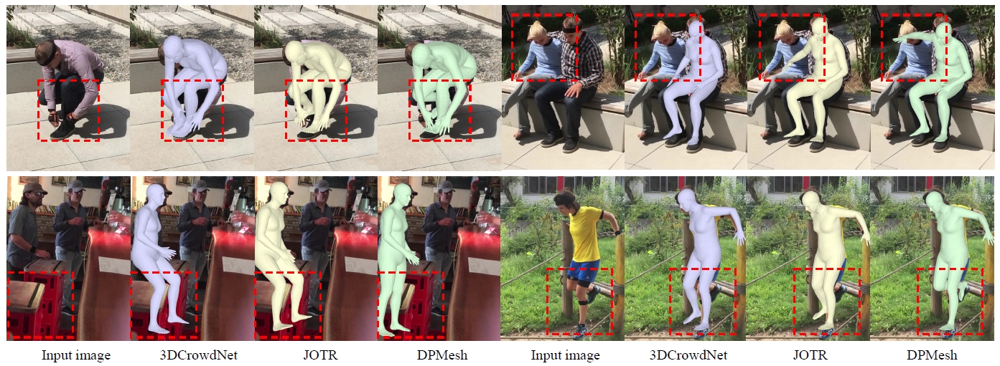
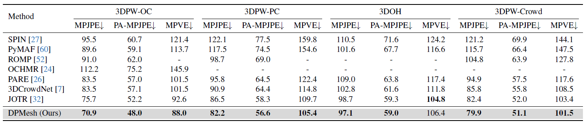

# DPMesh: Exploiting Diffusion Prior for Occluded Human Mesh Recovery
*Yixuan Zhu\*, Ao Li\*, Yansong Tang, Wenliang Zhao, Jie Zhou, Jiwen Lu*
----
The repository contains the official implementation of "DPMesh: Exploiting Diffusion Prior for Occluded Human Mesh Recovery"

## 📋 To Do List
* [ ] Environmnet Settings.
* [ ] Release model and inference code.

## ⭐️ Pipeline

## ⭐️ Performance

## ⚙️ Installation

## 🫰 Acknowledgments

We would like to express our sincere thanks to the author of [JOTR](https://github.com/xljh0520/JOTR) for the clear code base and quick response for our issues. 

We also thank [ControlNet](https://github.com/lllyasviel/ControlNet), [VPD](https://github.com/wl-zhao/VPD) and [LoRA](https://github.com/cloneofsimo/lora), for our code is partially borrowing from them.

## 🔖 Citation

## 🔑 License

This code is distributed under an [MIT LICENSE](./LICENSE).
